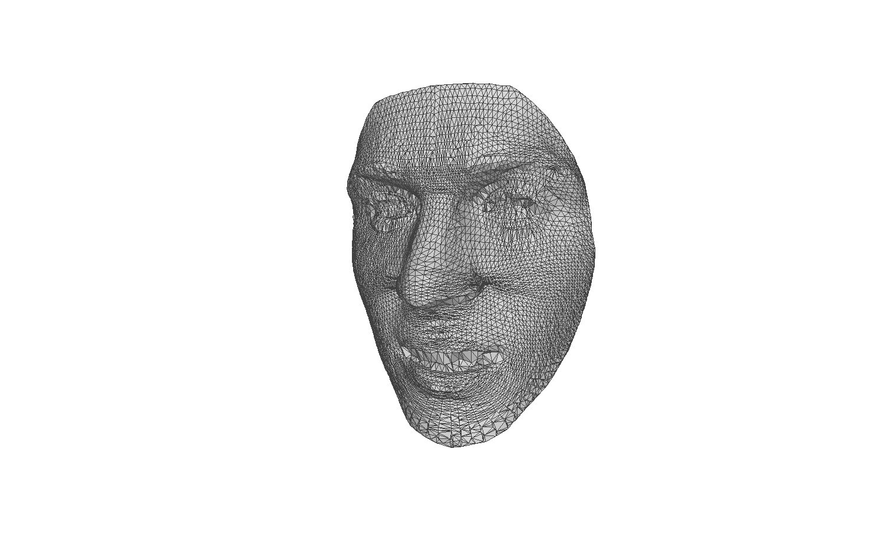

3D Face Classification with Graph Neural Networks
===

In this project I built a simple Graph Neural Network model to attack the problem of 3D data classification. The datasets employed in this project are graph-representations of triangular meshes of facial data, obtained with structured-light based 3D system.

## Repository structure

The repository is structured as following:
- `config.py `: Python dictionary containing the hyperparameters for the training procedure.
- `data.py`: Input data pipeline (loading, pre-processing, ...)
- `main.py`: Script that handles the training phase
- `models.py`: Contains the code for a few GNN models
- `test.py`: Script that handles the testing phase
- `graph_data/`: Directory containing the datasets
- `runs/`: Directory containing the experiments

## The data

I cannot share my data but, if you want to build a new dataset, follow this procedure: assuming that you have a set of 3D meshes in `.obj` format you have to group them by class into their relative sub-directories. Let' say you have a dataset like this:

```
./data/my_dataset/
```
where every subdirectory of `my_dataset/` represents an identity, which contains a number of meshes, e.g.
```
./data/my_dataset/id000/id000_0.obj
./data/my_dataset/id000/id000_1.obj
...
```
You just have to run `./data/to_graph.py` and a new directory will be created under `./graph_data/`, containing the freshly build dataset of graphs derived by their relative meshes.

This is an example of the data I've dealt with
<p align="center">
  
</p>


## The model

TODO

## Running a new experiment

Once you're set up with the data you just have to set your hyperparameters under `./config.py` and run `python main.py`.

A Tensorboard log containing the hyperparameters, learning curves and histograms will be logged under `./runs/`

Every 100 epochs both the model state and optimizer state dictionaries will be saved inside the same sub-directory.

## Testing a model

If you want to test a model you just need to pass the relative `./runs/` sub-directory to the `./test.py` script. Let's say you want to test the model logged under `./runs/exp_000/`, then you just need to run 
```
python test.py --exp_dir ./runs/exp000
```

## Dependencies

Running
```
conda env create -f torchgeom.yml
```
will create an environment containing all the packages needed for this project (CUDA 10.2, cudnn 7.6). 

The main dependencies are
```
python 3.7.7
torch 1.5.1
torch_geometric 1.6.0
tensorboard 2.2.2
numpy 1.18.5
scikit-learn 0.23.1
trimesh 3.8.8
tqdm 4.47.0
```